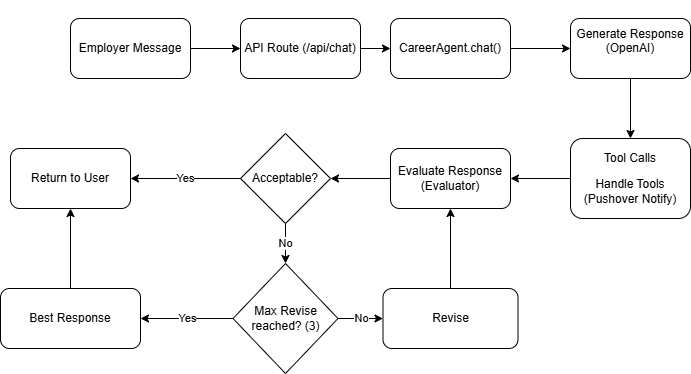

# Career Assistant AI Agent

An AI-powered career assistant that automatically replies to employer messages on your behalf — safely, professionally, and grounded in your real CV.

Built as a full-stack Next.js application with OpenAI tool-calling, a self-evaluation loop, and human-in-the-loop notifications.

---

## Badges

[](https://nextjs.org/)
[](https://www.typescriptlang.org/)
[](https://openai.com/)
[](https://vercel.com/)

---

## Overview

This project implements a **safe AI career agent** that handles early-stage employer communications without misrepresenting the user’s background.

The system is designed to:

- Generate polite, concise, first-person replies  
- Ground every claim in the user’s real CV  
- Automatically evaluate and improve responses  
- Escalate sensitive or unknown questions  
- Prevent hallucinations and off-topic answers  

---

## Key Features

### Primary Agent
- Uses GPT-4o-mini to generate professional replies  
- Operates under strict behavioral rules  
- Writes in first person as the user  

### Self-Evaluation Loop
- Secondary judge model scores each reply on:
  - professionalism
  - clarity
  - completeness
  - safety
  - relevance
  - career relevance
- Automatically retries up to **3 times** if quality is insufficient

### Tool Calling
- Extracts employer details automatically  
- Flags unknown or sensitive questions  
- Integrates with structured tools

### Human-in-the-Loop
- Sends Pushover notifications when:
  - a new employer contacts the user
  - a question requires manual review

### CV Grounding
The agent reads local files before every reply:

```
./me/ecg-summary.txt  
./me/ecg-linkedin.txt
```

This ensures factual accuracy and prevents hallucinations.

### Confidence Score
Each response returns a numeric confidence value shown in the UI.

---

## Tech Stack

| Layer | Technology |
|------|------------|
| Frontend / Backend | Next.js (App Router) |
| Language | TypeScript |
| AI Model | GPT-4o-mini |
| Notifications | Pushover |
| Deployment | Vercel |
| File Access | fs / path |

---

## System Architecture

[]()

---

## Setup & Installation

### 1. Clone the repository

```bash
git clone https://github.com/emircan-gezer/advanced-web-programming-1.git
cd advanced-web-programming-1
```

### 2. Install dependencies

```bash
npm install
```

### 3. Configure environment variables

Create `.env.local` in the project root:

```env
OPENAI_API_KEY=sk-...
PUSHOVER_TOKEN=...
PUSHOVER_USER=...
```

### 4. Add CV files (recommended)

Place your CV sources in:

```
./me/ecg-summary.txt
./me/ecg-linkedin.txt
```

### 5. Run locally

```bash
npm run dev
```

Open:

```
http://localhost:3000
```

---

## Usage

Send employer messages via the chat UI or directly to:

```
POST /api/chat
```

### Example Request

```json
{
  "message": "Hi, we'd like to invite you for an interview next week."
}
```

### Example Response

```json
{
  "reply": "Thank you for the invitation...",
  "confidence": 0.92,
  "evaluation_log": []
}
```

---

## Example Behaviors

| Scenario | Employer Message | Expected Behavior |
|--------|------------------|-------------------|
| Interview Invitation | "Hi, we want to invite you for an interview next week." | Polite confirmation and interest |
| Technical Question | "Tell me about your React experience." | Truthful CV-grounded answer |
| Sensitive Question | "What's your current salary?" | Safe deferral + notification |
| Greeting | "Hello" | Simple professional greeting |
| Off-topic | "What's the weather like?" | Polite decline |

---

## Failure Handling

- Maximum **3 automatic revisions**
- Falls back to best-scoring response if needed
- Pushover failures are logged but do not block replies
- Off-topic or unsafe content is safely declined

---

## Live Demo

https://advanced-web-programming-1.vercel.app/

---

## License

MIT

---

## Author

**Emircan Gezer**  
Student Project — Advanced Web Programming  
Built February 2026